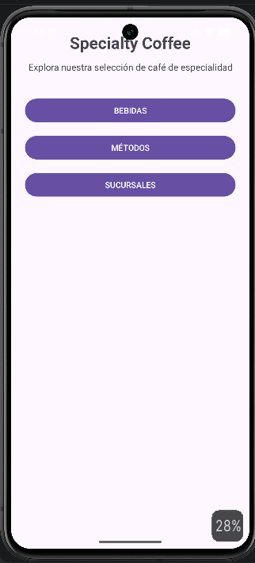
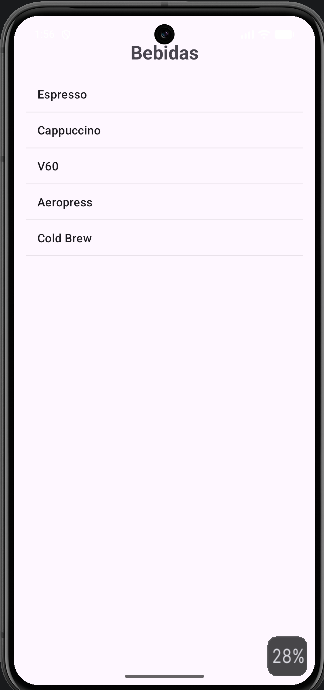
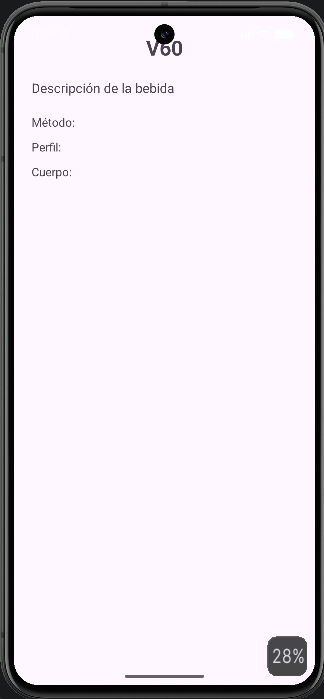
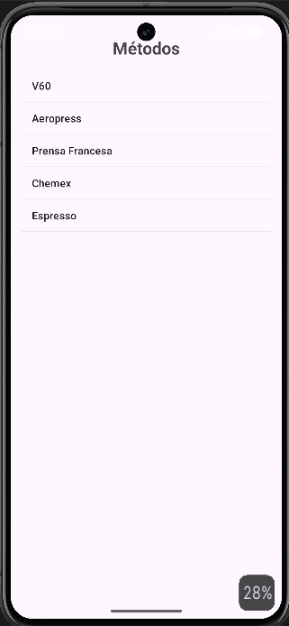
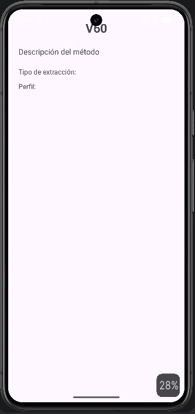
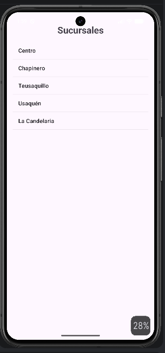
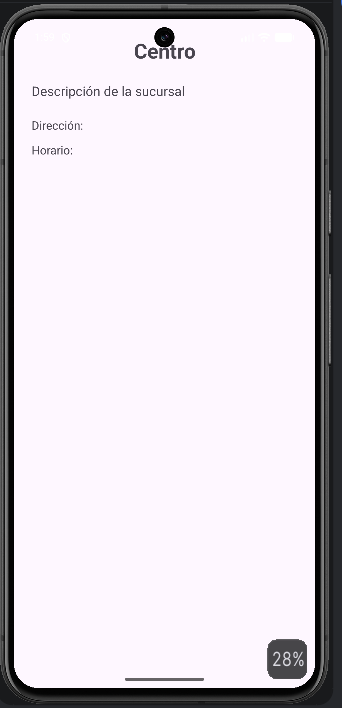

# Specialty Coffee

## Descripción

**Specialty Coffee** es una aplicación Android desarrollada como propuesta de navegación para una cafetería de especialidad genérica.

El proyecto fue desarrollado como parte del laboratorio **List Views and Adapters**, cuyo objetivo es comprender mecanismos disponibles para diseñar la navegabilidad de una aplicación Android.

La aplicación implementa una navegación jerárquica basada en tres niveles:

**Top-level → Category → Detail**


## Objetivo

Diseñar e implementar una propuesta propia de navegación para una aplicación Android utilizando los elementos estudiados en el laboratorio:

- Activities
- Intents
- ListView
- ArrayAdapter
- OnItemClickListener
- Navegación entre pantallas
- Envío de información entre Activities


## Propuesta de navegación

La aplicación representa una cafetería de especialidad y cuenta con tres categorías principales:

```text
                          Specialty Coffee
                                │
             ┌──────────────────┼──────────────────┐
             ▼                  ▼                  ▼
          BEBIDAS            MÉTODOS          SUCURSALES
             │                  │                  │
             ▼                  ▼                  ▼
          ListView            ListView            ListView
             │                  │                  │
             ▼                  ▼                  ▼
          Detalle             Detalle             Detalle
```

### Nivel Top-level

La pantalla principal permite acceder a:

- Bebidas
- Métodos
- Sucursales

### Nivel Category

Cada categoría presenta sus elementos mediante un `ListView`.

### Nivel Detail

Al seleccionar un elemento de una lista, la aplicación navega hacia una pantalla de detalle correspondiente.


## Tecnologías utilizadas

- Android Studio
- Java
- XML
- Android SDK
- ListView
- ArrayAdapter
- Intent
- OnItemClickListener


## Estructura de navegación

### 1. Pantalla principal

La `MainActivity` funciona como pantalla principal de la aplicación.

Desde ella el usuario puede acceder a las tres categorías:

- Bebidas
- Métodos
- Sucursales

### 2. Bebidas

La `BebidasActivity` utiliza un `ListView` y un `ArrayAdapter` para mostrar:

- Espresso
- Cappuccino
- V60
- Aeropress
- Cold Brew

Al seleccionar una bebida, se abre `DetalleBebidaActivity`.

### 3. Métodos

La `MetodosActivity` utiliza un `ListView` y un `ArrayAdapter` para mostrar:

- V60
- Aeropress
- Prensa Francesa
- Chemex
- Espresso

Al seleccionar un método, se abre `DetalleMetodoActivity`.

### 4. Sucursales

La `SucursalesActivity` utiliza un `ListView` y un `ArrayAdapter` para mostrar:

- Centro
- Chapinero
- Teusaquillo
- Usaquén
- La Candelaria

Al seleccionar una sucursal, se abre `DetalleSucursalActivity`.

## ListView y ArrayAdapter

Los datos de cada categoría se almacenan inicialmente en arreglos de Java.
Por ejemplo:

```java
String[] bebidas = {
    "Espresso",
    "Cappuccino",
    "V60",
    "Aeropress",
    "Cold Brew"
};
```

Estos datos son asociados al `ListView` mediante un `ArrayAdapter`:

```java
ArrayAdapter<String> adapter = new ArrayAdapter<>(
        this,
        android.R.layout.simple_list_item_1,
        bebidas
);

drinksListView.setAdapter(adapter);
```

De esta manera, el `ArrayAdapter` funciona como intermediario entre los datos y los elementos visuales mostrados en el `ListView`.

## Selección de elementos

Cada `ListView` utiliza un `OnItemClickListener` para detectar la selección realizada por el usuario.
Por ejemplo:

```java
drinksListView.setOnItemClickListener(
        (parent, view, position, id) -> {

            String bebidaSeleccionada = bebidas[position];

            Intent intent = new Intent(
                    BebidasActivity.this,
                    DetalleBebidaActivity.class
            );

            intent.putExtra(
                    "bebida",
                    bebidaSeleccionada
            );

            startActivity(intent);
        }
);
```

La posición seleccionada permite identificar el elemento correspondiente y enviarlo a la Activity de detalle.

## Comunicación entre Activities

La aplicación utiliza `Intent` para realizar la navegación entre Activities.
Además, se utiliza `putExtra()` para enviar información de la selección.
Ejemplo:

```java
intent.putExtra("bebida", bebidaSeleccionada);
```

La Activity de destino recupera la información mediante:

```java
String bebidaSeleccionada =
        getIntent().getStringExtra("bebida");
```

Este mecanismo permite reutilizar una misma Activity de detalle para diferentes elementos.

## Pruebas realizadas: Se realizaron pruebas funcionales de las diferentes rutas de navegación.

### Ruta de bebidas

```text
MainActivity
    ↓
BebidasActivity
    ↓
Selección de bebida
    ↓
DetalleBebidaActivity
```

### Ruta de métodos

```text
MainActivity
    ↓
MetodosActivity
    ↓
Selección de método
    ↓
DetalleMetodoActivity
```

### Ruta de sucursales

```text
MainActivity
    ↓
SucursalesActivity
    ↓
Selección de sucursal
    ↓
DetalleSucursalActivity
```

Se verificó que:

- La pantalla principal se inicia correctamente.
- Los botones de las categorías funcionan.
- Los `ListView` muestran correctamente sus elementos.
- Los elementos de las listas pueden seleccionarse.
- La navegación hacia las pantallas de detalle funciona.
- La información seleccionada se transmite correctamente mediante `Intent`.

## Evidencias
Las evidencias del laboratorio corresponden a las diferentes pantallas y rutas de navegación implementadas.

### Pantalla principal

La pantalla principal permite acceder a las categorías de la aplicación.



### Lista de bebidas

Lista de bebidas implementada mediante `ListView` y `ArrayAdapter`.



### Detalle de bebida

Pantalla mostrada después de seleccionar una bebida.



### Lista de métodos

Lista de métodos de preparación.



### Detalle de método

Pantalla de detalle correspondiente al método seleccionado.



### Lista de sucursales

Lista de sucursales disponibles.



### Detalle de sucursal

Pantalla de detalle correspondiente a la sucursal seleccionada.



## Estructura principal del proyecto

```text
SpecialtyCoffee/
│
├── app/
│   └── src/
│       └── main/
│           ├── java/
│           │   └── co/
│           │       └── edu/
│           │           └── unipiloto/
│           │               └── specialtycoffee/
│           │                   ├── MainActivity.java
│           │                   ├── BebidasActivity.java
│           │                   ├── DetalleBebidaActivity.java
│           │                   ├── MetodosActivity.java
│           │                   ├── DetalleMetodoActivity.java
│           │                   ├── SucursalesActivity.java
│           │                   └── DetalleSucursalActivity.java
│           │
│           └── res/
│               └── layout/
│                   ├── activity_main.xml
│                   ├── activity_bebidas.xml
│                   ├── activity_detalle_bebida.xml
│                   ├── activity_metodos.xml
│                   ├── activity_detalle_metodo.xml
│                   ├── activity_sucursales.xml
│                   └── activity_detalle_sucursal.xml
│
├── evidencias/
│   ├── Main.png
│   ├── Bebidas.png
│   ├── DescripcionBebidas.png
│   ├── Metodos.png
│   ├── DescripcionMetodo.png
│   ├── Sucursales.png
│   └── DescripcionSucursal.png
│
├── README.md
└── ...
```

## Ejecución
Para ejecutar el proyecto:

1. Abrir el proyecto `SpecialtyCoffee` en Android Studio.
2. Esperar la sincronización de Gradle.
3. Conectar un dispositivo Android o iniciar un emulador.
4. Ejecutar la aplicación mediante **Run**.
5. La aplicación inicia en `MainActivity`.
6. Seleccionar cualquiera de las categorías disponibles para comenzar la navegación.

## Autor: **Christian Lopez**

Universidad Piloto de Colombia
Laboratorio: **List Views and Adapters**
