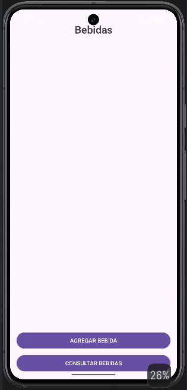
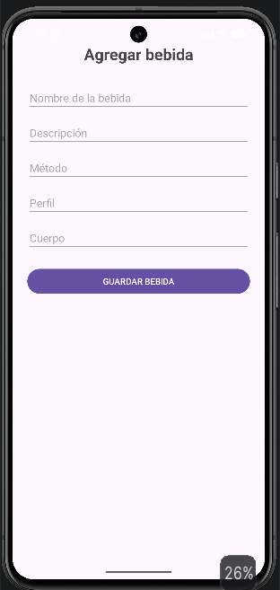
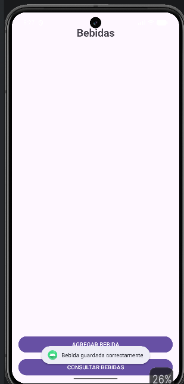
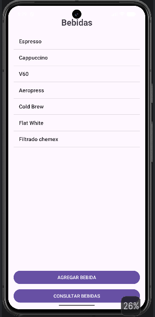
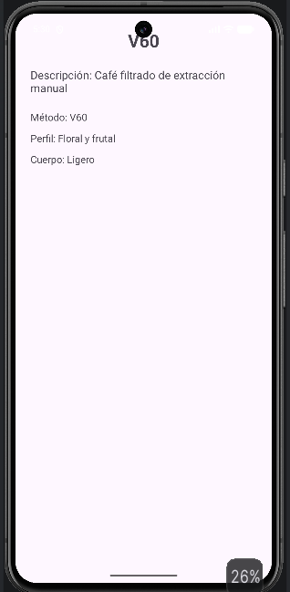

# Specialty Coffee

## Descripción

**Specialty Coffee** es una aplicación Android desarrollada como propuesta de navegación para una cafetería de especialidad genérica.

El proyecto fue desarrollado progresivamente como parte de diferentes laboratorios de la Universidad Piloto de Colombia. En la primera etapa se trabajó la navegación mediante **List Views and Adapters** y posteriormente se incorporó persistencia local mediante **SQLite**.

La aplicación implementa una navegación jerárquica basada en tres niveles:
**Top-level → Category → Detail**
Posteriormente, la entidad **Bebidas** fue seleccionada para incorporar persistencia de datos mediante SQLite.

# Laboratorios desarrollados
## Laboratorio 1: List Views and Adapters
En esta primera etapa se diseñó e implementó una propuesta propia de navegación para una aplicación Android utilizando:
  - Activities
  - Intents
  - ListView
  - ArrayAdapter
  - OnItemClickListener
  - Navegación entre pantallas
  - Envío de información entre Activities
La aplicación cuenta con tres categorías principales:
  - Bebidas
  - Métodos
  - Sucursales
Cada categoría contiene una lista de elementos y una pantalla de detalle.

## Laboratorio 2 — Persistencia con SQLite
  En la segunda etapa se incorporó persistencia local mediante **SQLite**.
  Se seleccionó la entidad **Bebidas** para implementar:
    - Formulario de captura de información.
    - Adición de datos a SQLite.
    - Consulta de registros almacenados.
    - Visualización de los registros mediante un ListView.
    - Consulta del detalle de una bebida.
  La funcionalidad de persistencia se desarrolló sobre la estructura existente del proyecto,
  manteniendo las funcionalidades de navegación implementadas en el laboratorio anterior.

# Objetivos
## Objetivo del laboratorio List Views and Adapters
Diseñar e implementar una propuesta propia de navegación para una aplicación Android utilizando los elementos estudiados en el laboratorio.

## Objetivo del laboratorio SQLite
Implementar persistencia local utilizando SQLite dentro de la aplicación, permitiendo capturar, almacenar y consultar información correspondiente a la entidad **Bebidas**.

# Propuesta de navegación
La aplicación representa una cafetería de especialidad y cuenta con tres categorías principales:
```text
                         Specialty Coffee
                               │
            ┌──────────────────┼──────────────────┐
            ▼                  ▼                  ▼
         BEBIDAS            MÉTODOS          SUCURSALES
            │                  │                  │
            ▼                  ▼                  ▼
         ListView            ListView            ListView
            │                  │                  │
            ▼                  ▼                  ▼
         Detalle             Detalle             Detalle
```
## Nivel Top-level
La pantalla principal permite acceder a:
  - Bebidas
  - Métodos
  - Sucursales
## Nivel Category
Cada categoría presenta sus elementos mediante un `ListView`.
## Nivel Detail
Al seleccionar un elemento de una lista, la aplicación navega hacia una pantalla de detalle correspondiente.

# Tecnologías utilizadas:
  - Android Studio
  - Java
  - XML
  - Android SDK
  - SQLite
  - SQLiteOpenHelper
  - SQLiteDatabase
  - ContentValues
  - Cursor
  - ListView
  - ArrayAdapter
  - Intent
  - OnItemClickListener

# Estructura de navegación
## 1. Pantalla principal
La `MainActivity` funciona como pantalla principal de la aplicación.
Desde ella el usuario puede acceder a las tres categorías:
  - Bebidas
  - Métodos
  - Sucursales

## 2. Bebidas
La `BebidasActivity` utiliza un `ListView` y un `ArrayAdapter` para mostrar inicialmente:
  - Espresso
  - Cappuccino
  - V60
  - Aeropress
  - Cold Brew

En la segunda etapa del proyecto, esta categoría incorpora persistencia mediante SQLite.
El usuario puede:
  - Agregar una nueva bebida.
  - Consultar las bebidas almacenadas.
  - Seleccionar una bebida.
  - Visualizar su información detallada.

## 3. Métodos
La `MetodosActivity` utiliza un `ListView` y un `ArrayAdapter` para mostrar:
  - V60
  - Aeropress
  - Prensa Francesa
  - Chemex
  - Espresso
Al seleccionar un método, se abre `DetalleMetodoActivity`.

## 4. Sucursales
La `SucursalesActivity` utiliza un `ListView` y un `ArrayAdapter` para mostrar:
  - Centro
  - Chapinero
  - Teusaquillo
  - Usaquén
  - La Candelaria
Al seleccionar una sucursal, se abre `DetalleSucursalActivity`.

# ListView y ArrayAdapter

En el primer laboratorio, los elementos de las categorías se almacenaban inicialmente en arreglos de Java. Por ejemplo:

```java
String[] bebidas = {
        "Espresso",
        "Cappuccino",
        "V60",
        "Aeropress",
        "Cold Brew"
};
```

Estos datos eran asociados al `ListView` mediante un `ArrayAdapter`:

```java
ArrayAdapter<String> adapter = new ArrayAdapter<>(
        this,
        android.R.layout.simple_list_item_1,
        bebidas
);

drinksListView.setAdapter(adapter);
```

De esta manera, el `ArrayAdapter` funciona como intermediario entre los datos y los elementos visuales mostrados en el `ListView`.

# Selección de elementos

Cada `ListView` utiliza un `OnItemClickListener` para detectar la selección realizada por el usuario.
En la implementación actual de `BebidasActivity`, los elementos consultados desde SQLite se almacenan en un `ArrayList`.
Por ejemplo:

```java
drinksListView.setOnItemClickListener(
        (parent, view, position, id) -> {

            String bebidaSeleccionada =
                    bebidas.get(position);

            Intent intent = new Intent(
                    BebidasActivity.this,
                    DetalleBebidaActivity.class
            );

            intent.putExtra(
                    "bebida",
                    bebidaSeleccionada
            );

            startActivity(intent);
        }
);
```

La posición seleccionada permite identificar el elemento correspondiente y enviarlo a la Activity de detalle.

# Comunicación entre Activities

La aplicación utiliza `Intent` para realizar la navegación entre Activities.
Además, se utiliza `putExtra()` para enviar información de la selección.
Ejemplo:

```java
intent.putExtra(
        "bebida",
        bebidaSeleccionada
);
```

La Activity de destino recupera la información mediante:

```java
String bebidaSeleccionada =
        getIntent().getStringExtra("bebida");
```

Este mecanismo permite comunicar la selección realizada en una lista con la pantalla de detalle correspondiente.

# Persistencia con SQLite
## Entidad seleccionada
Para el laboratorio de persistencia se seleccionó la entidad:
**Bebidas**
La información almacenada corresponde a:

| Campo | Tipo | Descripción |
|---|---|---|
| `id` | INTEGER | Identificador único |
| `nombre` | TEXT | Nombre de la bebida |
| `descripcion` | TEXT | Descripción de la bebida |
| `metodo` | TEXT | Método utilizado |
| `perfil` | TEXT | Perfil de sabor |
| `cuerpo` | TEXT | Cuerpo de la bebida |

# Base de datos

Se creó una base de datos local llamada:
```text
specialtycoffee.db
```

La administración de la base de datos se realiza mediante:
```text
DatabaseHelper.java
```

La clase utiliza `SQLiteOpenHelper` para administrar la creación y actualización de la base de datos.

# Tabla bebidas
La tabla utilizada para almacenar la información se denomina:

```text
bebidas
```

Su estructura es:

```sql
CREATE TABLE bebidas (
    id INTEGER PRIMARY KEY AUTOINCREMENT,
    nombre TEXT NOT NULL,
    descripcion TEXT,
    metodo TEXT,
    perfil TEXT,
    cuerpo TEXT
);
```

---

# Inserción de bebidas
Se implementó el método:

```java
public long insertarBebida(
        String nombre,
        String descripcion,
        String metodo,
        String perfil,
        String cuerpo
)
```

Este método utiliza `ContentValues` para preparar los datos:

```java
ContentValues values = new ContentValues();

values.put("nombre", nombre);
values.put("descripcion", descripcion);
values.put("metodo", metodo);
values.put("perfil", perfil);
values.put("cuerpo", cuerpo);

return db.insert(
        "bebidas",
        null,
        values
);
```

El método permite insertar una nueva bebida en SQLite.

# Consulta de bebidas
La consulta de los registros almacenados se realiza mediante:
```java
public Cursor obtenerBebidas() {

    SQLiteDatabase db =
            this.getReadableDatabase();

    return db.rawQuery(
            "SELECT * FROM bebidas",
            null
    );
}
```
La consulta utilizada es:
```sql
SELECT * FROM bebidas;
```

El resultado se obtiene mediante un `Cursor`.

# Consulta de una bebida específica
También se implementó una consulta para recuperar una bebida específica:

```java
public Cursor obtenerBebidaPorNombre(
        String nombre
) {

    SQLiteDatabase db =
            this.getReadableDatabase();

    return db.rawQuery(
            "SELECT * FROM bebidas WHERE nombre = ?",
            new String[]{nombre}
    );
}
```
Esta consulta permite recuperar la información completa de una bebida seleccionada.

# Formulario de captura
Para realizar la captura de información se creó:
```text
AgregarBebidasActivity.java
```

junto con:
```text
activity_agregar_bebidas.xml
```

El formulario permite ingresar:
  - Nombre
  - Descripción
  - Método
  - Perfil
  - Cuerpo
La interfaz cuenta con el botón:
```text
GUARDAR BEBIDA
```

# Guardar una bebida
Al presionar **GUARDAR BEBIDA**, la aplicación obtiene los valores introducidos en el formulario y los envía a:
```java
databaseHelper.insertarBebida(
        nombre,
        descripcion,
        metodo,
        perfil,
        cuerpo
);
```
El flujo de almacenamiento es:
```text
Formulario
     ↓
AgregarBebidasActivity
     ↓
DatabaseHelper
     ↓
SQLiteDatabase
     ↓
INSERT
     ↓
Tabla bebidas
```
Cuando la operación se realiza correctamente se muestra:
```text
Bebida guardada correctamente
```

---

# Consultar bebidas mediante un botón.
Para realizar la consulta se agregó un botón independiente:

```text
CONSULTAR BEBIDAS
```
Este botón ejecuta:

```java
queryDrinkButton.setOnClickListener(v -> {

    cargarBebidas();

    adapter.notifyDataSetChanged();

    Toast.makeText(
            this,
            "Bebidas consultadas desde SQLite",
            Toast.LENGTH_SHORT
    ).show();
});
```

La función `cargarBebidas()` obtiene los datos mediante:

```java
Cursor cursor =
        databaseHelper.obtenerBebidas();
```
Posteriormente se recorren los registros:

```java
if (cursor.moveToFirst()) {

    do {

        String nombre =
                cursor.getString(
                        cursor.getColumnIndexOrThrow(
                                "nombre"
                        )
                );

        bebidas.add(nombre);

    } while (cursor.moveToNext());
}
```
Finalmente, el `ArrayAdapter` actualiza el `ListView`.

# Flujo de persistencia
El funcionamiento de la persistencia implementada es:

```text
                    BEBIDAS
                       │
          ┌────────────┴────────────┐
          ▼                         ▼
   AGREGAR BEBIDA            CONSULTAR BEBIDAS
          │                         │
          ▼                         ▼
      Formulario                SQLite
          │                         │
          ▼                         ▼
  GUARDAR BEBIDA                  SELECT
          │                         │
          ▼                         ▼
       SQLite                    Cursor
                                    │
                                    ▼
                                ArrayList
                                    │
                                    ▼
                                ListView
```

# Integración entre navegación y SQLite
La implementación combina las funcionalidades de ambos laboratorios. El flujo de Bebidas es:
```text
MainActivity
     ↓
BebidasActivity
     │
     ├───────────────┐
     │               │
     ▼               ▼
AGREGAR          CONSULTAR
BEBIDA           BEBIDAS
     │               │
     ▼               ▼
Formulario         SQLite
     │               │
     ▼               ▼
   INSERT           SELECT
     │               │
     └───────┬───────┘
             ▼
       Lista de bebidas
             │
             ▼
       Selección de bebida
             │
             ▼
   DetalleBebidaActivity
             │
             ▼
       Consulta SQLite
```

# Pruebas realizadas
Se realizaron pruebas funcionales de las diferentes rutas de navegación y de las funcionalidades de persistencia.

## Pruebas de navegación
Se verificó que:
  - La pantalla principal se inicia correctamente.
  - Los botones de las categorías funcionan.
  - Los `ListView` muestran correctamente sus elementos.
  - Los elementos de las listas pueden seleccionarse.
  - La navegación hacia las pantallas de detalle funciona.
  - La información seleccionada se transmite correctamente mediante `Intent`.

## Pruebas de SQLite
Se verificó que:
  - El formulario de captura funciona correctamente.
  - Una bebida puede ser almacenada en SQLite.
  - El botón **CONSULTAR BEBIDAS** recupera los registros almacenados.
  - Los registros recuperados se muestran en el `ListView`.
  - Una bebida puede ser seleccionada desde la lista.
  - La información de la bebida seleccionada puede ser recuperada desde SQLite.
  - La pantalla de detalle muestra la información correspondiente.

# Evidencias: Laboratorio List Views and Adapters. 
Las evidencias de la primera etapa se encuentran en:

```text
Evidencias/
```
## Pantalla principal

La pantalla principal permite acceder a las diferentes categorías.


## Lista de bebidas

Lista de bebidas implementada mediante `ListView` y `ArrayAdapter`.


## Detalle de bebida

Pantalla mostrada después de seleccionar una bebida.


## Lista de métodos

Lista de métodos de preparación.


## Detalle de método

Pantalla de detalle correspondiente al método seleccionado.


## Lista de sucursales

Lista de sucursales disponibles.


## Detalle de sucursal

Pantalla de detalle correspondiente a la sucursal seleccionada.


# Evidencias: Laboratorio SQLite. Las evidencias de la segunda etapa se encuentran en:
```text
EvidenciasSQLite/
```
## Estado inicial de la lista

Esta evidencia muestra el estado de la pantalla de Bebidas antes de realizar la consulta.


## Formulario de captura

Formulario utilizado para ingresar la información de una nueva bebida.


## Bebida guardada

Evidencia de la operación de almacenamiento de una bebida.


## Registros recuperados

Evidencia de los registros recuperados mediante el botón **CONSULTAR BEBIDAS**.


## Detalle de bebida

Evidencia de la información correspondiente a una bebida seleccionada.


# Relación con los entregables
## Laboratorio 1: List Views and Adapters

| Requisito | Implementación |
|---|---|
| Propuesta propia de navegación | Specialty Coffee |
| Nivel Top-level | `MainActivity` |
| Categorías | Bebidas, Métodos y Sucursales |
| Listas | `ListView` |
| Adaptador | `ArrayAdapter` |
| Selección | `OnItemClickListener` |
| Navegación | `Intent` |
| Comunicación entre Activities | `putExtra()` / `getStringExtra()` |
| Pantallas de detalle | Activities independientes |

## Laboratorio 2: Persistencia con SQLite

| Requisito | Implementación |
|---|---|
| Entidad seleccionada | `Bebidas` |
| Persistencia local | SQLite |
| Base de datos | `specialtycoffee.db` |
| Tabla | `bebidas` |
| Formulario de captura | `AgregarBebidasActivity` |
| Botón de adición | `GUARDAR BEBIDA` |
| Inserción | `insertarBebida()` |
| Consulta | `obtenerBebidas()` |
| Botón de consulta | `CONSULTAR BEBIDAS` |
| Recuperación de registros | `Cursor` |
| Visualización | `ListView` + `ArrayAdapter` |
| Consulta de detalle | `obtenerBebidaPorNombre()` |

# Estructura general del proyecto
```text
SpecialtyCoffee/
│
├── app/
│   └── src/
│       └── main/
│           ├── java/
│           │   └── co/
│           │       └── edu/
│           │           └── unipiloto/
│           │               └── specialtycoffee/
│           │                   ├── MainActivity.java
│           │                   ├── BebidasActivity.java
│           │                   ├── DetalleBebidaActivity.java
│           │                   ├── AgregarBebidasActivity.java
│           │                   ├── DatabaseHelper.java
│           │                   ├── MetodosActivity.java
│           │                   ├── DetalleMetodoActivity.java
│           │                   ├── SucursalesActivity.java
│           │                   └── DetalleSucursalActivity.java
│           │
│           └── res/
│               └── layout/
│                   ├── activity_main.xml
│                   ├── activity_bebidas.xml
│                   ├── activity_detalle_bebida.xml
│                   ├── activity_agregar_bebidas.xml
│                   ├── activity_metodos.xml
│                   ├── activity_detalle_metodo.xml
│                   ├── activity_sucursales.xml
│                   └── activity_detalle_sucursal.xml
│
├── Evidencias/
│   ├── Main.png
│   ├── Bebidas.png
│   ├── DescripcionBebidas.png
│   ├── Metodos.png
│   ├── DescripcionMetodo.png
│   ├── Sucursales.png
│   └── DescripcionSucursal.png
│
├── EvidenciasSQLite/
│   ├── BebidaGuardada.png
│   ├── BebidasVacio.png
│   ├── DetalleBebida.png
│   ├── FormAgregarBebidas.png
│   └── ListaRegistrosRecuperados.png
│
├── README.md
└── ...
```

# Ejecución
Para ejecutar el proyecto:
  1. Abrir el proyecto `SpecialtyCoffee` en Android Studio.
  2. Esperar la sincronización de Gradle.
  3. Conectar un dispositivo Android o iniciar un emulador.
  4. Ejecutar la aplicación mediante **Run**.
  5. La aplicación inicia en `MainActivity`.
  6. Seleccionar cualquiera de las categorías disponibles.

Para probar la funcionalidad SQLite:
  1. Ingresar a **Bebidas**.
  2. Seleccionar **AGREGAR BEBIDA**.
  3. Completar el formulario.
  4. Presionar **GUARDAR BEBIDA**.
  5. Regresar a la pantalla de Bebidas.
  6. Presionar **CONSULTAR BEBIDAS**.
  7. Verificar los registros recuperados.
  8. Seleccionar una bebida para visualizar su detalle.

# Conclusión
Este proyecto **SpecialtyCoffee** evolucionó desde una propuesta de navegación basada en `Activities`, `ListView`, `ArrayAdapter` e `Intent`, hacia una aplicación que también incorpora persistencia local mediante SQLite.
La primera etapa permitió implementar la navegación:
```text
Top-level
    ↓
Category
    ↓
Detail
```
Mientras que la segunda etapa incorporó el flujo de persistencia:
```text
Capturar
    ↓
Guardar
    ↓
SQLite
    ↓
Consultar
    ↓
Mostrar
```
La integración de ambas etapas permite mantener la estructura de navegación original y agregar persistencia de información a la entidad **Bebidas**.

# Autor: **Christian Lopez**
**Universidad Piloto de Colombia**
**Proyecto:** Specialty Coffee
**Laboratorios:**
  - List Views and Adapters
  - Persistencia de datos con SQLite
